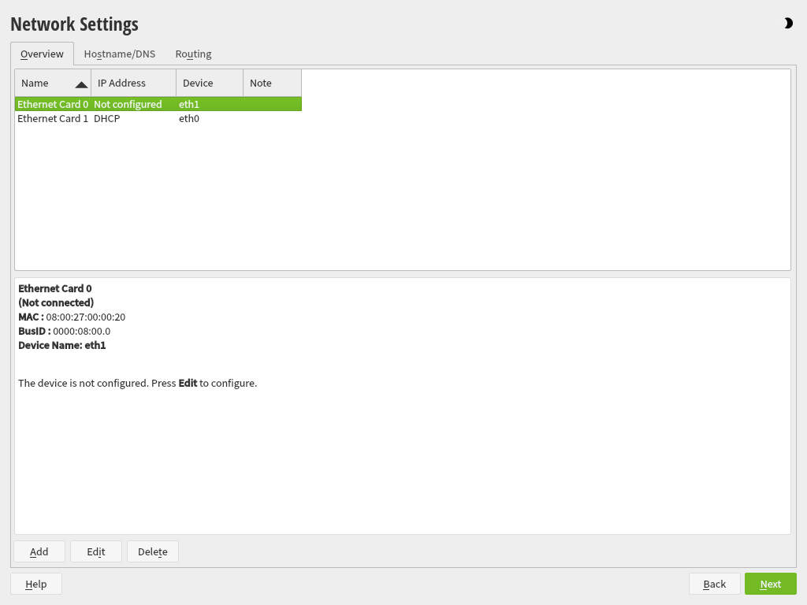

# About

This builds a [TrueNAS SCALE](https://www.truenas.com/truenas-scale/) vagrant box.

This also includes an example environment with:

* TrueNAS SCALE server.
    * `tank` storage pool.
    * `tank/sw` filesystem dataset.
    * `tank/ubuntu-data` zvol dataset.
    * `tank/windows-data` zvol dataset.
    * `tank/debian-live-boot` zvol dataset.
    * `tank/debian-boot` zvol dataset.
    * `tank/ubuntu-boot` zvol dataset.
    * `tank/opensuse-boot` zvol dataset.
    * `tank/windows-boot` zvol dataset.
    * `tank/k3s/v/pvc-` prefixed zvol datasets.
    * `sw` SMB share.
        * `tank/sw` dataset.
    * `ubuntu` iSCSI target share.
        * LUN 0: `tank/ubuntu-data` dataset.
    * `windows` iSCSI target share.
        * LUN 0: `tank/windows-data` dataset.
    * `debian-live-boot` iSCSI target read-only share.
        * LUN 0: `tank/debian-live-boot` dataset.
    * `debian-boot` iSCSI target share.
        * LUN 0: `tank/debian-boot` dataset.
    * `ubuntu-boot` iSCSI target share.
        * LUN 0: `tank/ubuntu-boot` dataset.
    * `opensuse-boot` iSCSI target share.
        * LUN 0: `tank/opensuse-boot` dataset.
    * `windows-boot` iSCSI target share.
        * LUN 0: `tank/windows-boot` dataset.
    * `csi-k3s-pvc-` prefixed iSCSI target shares.
        * LUN 0: `tank/k3s/v/pvc-` prefixed dataset for a Kubernetes PVC.
* Ubuntu client.
    * `ubuntu-data` iSCSI LUN 0 initialized and mounted at `/mnt/ubuntu-data`.
* Kubernetes and Ubuntu client.
    * iSCSI LUN initialized and mounted for a Kubernetes Persistent Volume Claims (PVC).
* Windows client.
    * `windows-data` iSCSI LUN 0 initialized and mounted at `D:`.
* iPXE and Debian live client.
    * `debian-live-boot` iSCSI LUN 0 used as the boot disk.
* iPXE and Debian client.
    * `debian-boot` iSCSI LUN 0 used as the boot disk.
    * **NB** Currently, the system cannot shutdown or reboot successfully, if you known how to fix this, please reach out!
    * **TODO** Fix the shutdown/reboot.
* iPXE and Ubuntu client.
    * `ubuntu-boot` iSCSI LUN 0 used as the boot disk.
* iPXE and openSUSE client.
    * `opensuse-boot` iSCSI LUN 0 used as the boot disk.
* iPXE and Windows client.
    * `windows-boot` iSCSI LUN 0 used as the boot disk.

# Usage

Add the following entries to your machine `hosts` file:

```
10.10.0.2  truenas.example.com
10.10.0.11 git.example.com
```

Depending on your hypervisor, build and install the base box and start the
example environment:

* [libvirt/kvm/linux](#libvirt-usage)
* [VMware vSphere](#vmware-vsphere-usage)

After the example environment is running, open the Web UI:

http://truenas.example.com

Use the Web API:

```bash
truenas_api_base_url='http://truenas.example.com/api/v2.0'
function api {
    # see http://truenas.example.com/api/docs/#restful
    # NB to use an api key, replace --user, --password and --auth-no-challenge,
    #    with --header, e.g.:
    #       wget -qO- --header "Authorization: Bearer $api_key" "$@"
    wget -qO- --user root --password root --auth-no-challenge "$truenas_api_base_url/$@"
}
api system/state | jq -r
api system/general | jq
api disk | jq
api pool | jq
api pool/dataset | jq
api sharing/smb | jq
api iscsi/portal | jq
api iscsi/target | jq
api iscsi/extent | jq
api iscsi/targetextent | jq
api iscsi/global/sessions | jq
```

Access the gitea example kubernetes application (which uses iSCSI persistent
storage) and login with the `gitea` username and the `abracadabra` password:

http://git.example.com

## libvirt usage

Install [`packer`](https://github.com/hashicorp/packer), [`vagrant`](https://github.com/hashicorp/vagrant), [`vagrant-libvirt`](https://github.com/vagrant-libvirt/vagrant-libvirt), and [`libvirt`](https://github.com/libvirt/libvirt) (see the [rgl/my-ubuntu-ansible-playbooks repository](https://github.com/rgl/my-ubuntu-ansible-playbooks)).

Install the [Ubuntu 22.04 box](https://github.com/rgl/ubuntu-vagrant).

Install the [Debian 12 box](https://github.com/rgl/debian-vagrant).

Install the [Windows 2022 box](https://github.com/rgl/windows-vagrant).

Build the box and add it to the local vagrant installation:

```bash
time make build-libvirt
vagrant box add -f truenas-scale-22.12-amd64 truenas-scale-22.12-amd64-libvirt.box.json
```

Download the example ISOs:

```bash
pushd example
wget -O openSUSE-Leap-15.4-NET-x86_64-Media.iso \
    https://download.opensuse.org/distribution/leap/15.4/iso/openSUSE-Leap-15.4-NET-x86_64-Media.iso
# see https://github.com/rgl/windows-evaluation-isos-scraper/blob/main/data/windows-2022.json
wget -O windows-2022-amd64.iso \
    https://software-static.download.prss.microsoft.com/sg/download/888969d5-f34g-4e03-ac9d-1f9786c66749/SERVER_EVAL_x64FRE_en-us.iso
wget -O virtio-win-0.1.229.iso \
    https://fedorapeople.org/groups/virt/virtio-win/direct-downloads/archive-virtio/virtio-win-0.1.229-1/virtio-win-0.1.229.iso
popd
```

Start the common VMs:

```bash
pushd example
time vagrant up --provider=libvirt --no-destroy-on-error --no-tty truenas pixie
```

Depending on what you want to try next, follow the sections:

* [ubuntu](#ubuntu)
* [k3s](#k3s)
* [windows](#windows)
* [debian_live_boot](#debian_live_boot)
* [debian_boot](#debian_boot)
* [ubuntu_boot](#ubuntu_boot)
* [opensuse_boot](#opensuse_boot)
* [windows_boot](#windows_boot)

### ubuntu

Start:

```bash
time vagrant up --provider=libvirt --no-destroy-on-error --no-tty ubuntu
```

### k3s

Start:

```bash
time vagrant up --provider=libvirt --no-destroy-on-error --no-tty k3s
```

Enter the `k3s` VM:

```bash
vagrant ssh k3s
sudo -i
```

List all the active iSCSI sessions:

```bash
iscsiadm -m session
```

List all the Kubernetes Persistent Volume Claim (PVC) and Persistent Volume (PV) objects:

```bash
kubectl get pvc -A
kubectl get pv -A
```

### windows

Start:

```bash
time vagrant up --provider=libvirt --no-destroy-on-error --no-tty windows
```

### debian_live_boot

Start:

```bash
time vagrant up --provider=libvirt --no-destroy-on-error --no-tty debian_live_boot
```

### debian_boot

Start:

```bash
time vagrant up --provider=libvirt --no-destroy-on-error --no-tty debian_boot
```

Login into the VM:

```bash
vagrant ssh debian_boot
sudo -i
```

Dump the IP configuration:

```bash
ip addr
```
```
1: lo: <LOOPBACK,UP,LOWER_UP> mtu 65536 qdisc noqueue state UNKNOWN group default qlen 1000
    link/loopback 00:00:00:00:00:00 brd 00:00:00:00:00:00
    inet 127.0.0.1/8 scope host lo
       valid_lft forever preferred_lft forever
    inet6 ::1/128 scope host 
       valid_lft forever preferred_lft forever
2: eth0: <BROADCAST,MULTICAST,UP,LOWER_UP> mtu 1500 qdisc pfifo_fast state UP group default qlen 1000
    link/ether 52:54:00:40:30:6e brd ff:ff:ff:ff:ff:ff
    altname enp5s0
    inet 192.168.121.162/24 brd 192.168.121.255 scope global dynamic eth0
       valid_lft 3594sec preferred_lft 3594sec
    inet6 fe80::5054:ff:fe40:306e/64 scope link 
       valid_lft forever preferred_lft forever
3: eth1: <BROADCAST,UP,LOWER_UP> mtu 9000 qdisc pfifo_fast state UP group default qlen 1000
    link/ether 08:00:27:00:00:21 brd ff:ff:ff:ff:ff:ff
    altname enp6s0
    inet 10.10.0.21/24 brd 10.10.0.255 scope global eth1
       valid_lft forever preferred_lft forever
    inet6 fe80::a00:27ff:fe00:21/64 scope link 
       valid_lft forever preferred_lft forever
```

Dump the iSCSI target from the iBFT:

```bash
cat /sys/firmware/ibft/target0/target-name
```
```
iqn.2005-10.org.freenas.ctl:debian-boot
```

Dump the iSCSI initiator name from the iBFT:

```bash
cat /sys/firmware/ibft/initiator/initiator-name
```
```
iqn.2010-04.org.ipxe:080027000021
```

Dump the iSCSI initiator name from the iscsid configuration:

```bash
cat /etc/iscsi/initiatorname.iscsi
```
```
InitiatorName=iqn.2010-04.org.ipxe:080027000021
```

Show the open iSCSI sessions:

```bash
iscsiadm -m session         # show brief information.
iscsiadm -m session -P 3    # show detailed information.
```
```
tcp: [1] 10.10.0.2:3260,1 iqn.2005-10.org.freenas.ctl:debian-boot (non-flash)
```

Show the detected partitions:

```bash
fdisk -l
```
```
Disk /dev/sda: 8 GiB, 8589934592 bytes, 16777216 sectors
Disk model: iSCSI Disk      
Units: sectors of 1 * 512 = 512 bytes
Sector size (logical/physical): 512 bytes / 16384 bytes
I/O size (minimum/optimal): 16384 bytes / 16384 bytes
Disklabel type: dos
Disk identifier: 0x14230726

Device     Boot Start      End  Sectors Size Id Type
/dev/sda1  *     2048 16775167 16773120   8G 83 Linux
```

Show the free space:

```bash
df -h
```
```
Filesystem      Size  Used Avail Use% Mounted on
udev            974M     0  974M   0% /dev
tmpfs           199M  3,1M  196M   2% /run
/dev/sda1       7,8G  1,5G  6,0G  20% /
tmpfs           992M     0  992M   0% /dev/shm
tmpfs           5,0M     0  5,0M   0% /run/lock
tmpfs           199M     0  199M   0% /run/user/1000
```

### ubuntu_boot

Start:

```bash
time vagrant up --provider=libvirt --no-destroy-on-error --no-tty ubuntu_boot
```

Login into the VM:

```bash
vagrant ssh ubuntu_boot
sudo -i
```

Dump the IP configuration:

```bash
ip addr
```
```
1: lo: <LOOPBACK,UP,LOWER_UP> mtu 65536 qdisc noqueue state UNKNOWN group default qlen 1000
    link/loopback 00:00:00:00:00:00 brd 00:00:00:00:00:00
    inet 127.0.0.1/8 scope host lo
       valid_lft forever preferred_lft forever
    inet6 ::1/128 scope host 
       valid_lft forever preferred_lft forever
2: eth0: <BROADCAST,MULTICAST,UP,LOWER_UP> mtu 1500 qdisc pfifo_fast state UP group default qlen 1000
    link/ether 52:54:00:da:4c:51 brd ff:ff:ff:ff:ff:ff
    altname enp5s0
    inet 192.168.121.202/24 metric 100 brd 192.168.121.255 scope global eth0
       valid_lft forever preferred_lft forever
    inet6 fe80::5054:ff:feda:4c51/64 scope link 
       valid_lft forever preferred_lft forever
3: eth1: <BROADCAST,UP,LOWER_UP> mtu 9000 qdisc pfifo_fast state UP group default qlen 1000
    link/ether 08:00:27:00:00:21 brd ff:ff:ff:ff:ff:ff
    altname enp6s0
    inet 10.10.0.21/24 brd 10.10.0.255 scope global eth1
       valid_lft forever preferred_lft forever
    inet6 fe80::a00:27ff:fe00:21/64 scope link 
       valid_lft forever preferred_lft forever
```

Dump the iSCSI target from the iBFT:

```bash
cat /sys/firmware/ibft/target0/target-name
```
```
iqn.2005-10.org.freenas.ctl:ubuntu-boot
```

Dump the iSCSI initiator name from the iBFT:

```bash
cat /sys/firmware/ibft/initiator/initiator-name
```
```
iqn.2010-04.org.ipxe:080027000021
```

Dump the iSCSI initiator name from the iscsid configuration:

```bash
cat /etc/iscsi/initiatorname.iscsi
```
```
InitiatorName=iqn.2004-10.com.ubuntu:01:1f309ecf3be
```

Show the open iSCSI sessions:

```bash
iscsiadm -m session         # show brief information.
iscsiadm -m session -P 3    # show detailed information.
```
```
tcp: [1] 10.10.0.2:3260,1 iqn.2005-10.org.freenas.ctl:ubuntu-boot (non-flash)
```

Show the detected partitions:

```bash
fdisk -l
```
```
Disk /dev/sda: 8 GiB, 8589934592 bytes, 16777216 sectors
Disk model: iSCSI Disk      
Units: sectors of 1 * 512 = 512 bytes
Sector size (logical/physical): 512 bytes / 16384 bytes
I/O size (minimum/optimal): 16384 bytes / 16384 bytes
Disklabel type: dos
Disk identifier: 0x9d200a48

Device     Boot Start      End  Sectors Size Id Type
/dev/sda1        2048 16777215 16775168   8G 83 Linux
```

Show the free space:

```bash
df -h
```
```
Filesystem      Size  Used Avail Use% Mounted on
tmpfs           198M  1.1M  197M   1% /run
/dev/sda1       7.8G  4.3G  3.2G  58% /
tmpfs           988M     0  988M   0% /dev/shm
tmpfs           5.0M     0  5.0M   0% /run/lock
tmpfs           198M  4.0K  198M   1% /run/user/1000
```

### opensuse_boot

Start:

```bash
time vagrant up --provider=libvirt --no-destroy-on-error --no-tty opensuse_boot
```

Open the VM console.

Advance the installer to the `Disk Activation` page:


Click the `Network Configuration...` button. You should now see the `Network Settings` page:



Select the `Ethernet Card 0` (`eth1`), and click the `Edit` button. You should now see the `Network Card Setup` page:


Click the `Dynamic Address` radio button, and select `DHCP`.

Click the `Next` button. You should now see the `Network Settings` page:


Ensure both network cards are configured with `DHCP`.

Click the `Next` button. Eventually, you should see the `Disk Activation` page again:


Click the `Configure iSCSI Disks` button. You should see the `iSCSI Initiator Overview` page:


Ensure the following properties are set:

| Property       | Value                               |
|----------------|-------------------------------------|
| Initiator Name | `iqn.2010-04.org.ipxe:080027000020` |
| Offload Card   | `default (Software)`                |

Click the `Connected Targets` tab. Then, click the `Add` button. Then set the properties as:


| Property       | Value       |
|----------------|-------------|
| IP Address     | `10.10.0.2` |
| Port           | `3260`      |

Click the `Next` button. You should see the page:


Select the `iqn.2005.org.freenas.ctl:opensuse-boot` target name, and click the `Connect` button.

Set as:


Click the `Next` button, then click the `Cancel` button. You should now be back at the `Disk Activation` page:


Click the `Next` button. You should advance the installer until the `Disk` `Suggested Partitioning` page:


Click the `Next` button.

Advance the installer until the installation finishes.

Power-off the VM.

Configure the VM to boot from the second ethernet interface as:


Start the VM.

Login into the VM.

Dump the IP configuration:

```bash
ip addr
```
```
1: lo: <LOOPBACK,UP,LOWER_UP> mtu 65536 qdisc noqueue state UNKNOWN group default qlen 1000
    link/loopback 00:00:00:00:00:00 brd 00:00:00:00:00:00
    inet 127.0.0.1/8 scope host lo
       valid_lft forever preferred_lft forever
    inet6 ::1/128 scope host
       valid_lft forever preferred_lft forever
2: eth0: <BROADCAST,MULTICAST,UP,LOWER_UP> mtu 1500 qdisc pfifo_fast state UP group default qlen 1000
    link/ether 52:54:00:26:21:08 brd ff:ff:ff:ff:ff:ff
    altname enp7s0
    inet 192.168.121.82/24 brd 192.168.121.255 scope global eth0
       valid_lft forever preferred_lft forever
    inet6 fe80::5054:ff:fe26:2108/64 scope link
       valid_lft forever preferred_lft forever
3: eth1: <BROADCAST,MULTICAST,UP,LOWER_UP> mtu 9000 qdisc pfifo_fast state UP group default qlen 1000
    link/ether 08:00:27:00:00:20 brd ff:ff:ff:ff:ff:ff
    altname enp8s0
    inet 10.10.0.20/24 brd 10.10.0.255 scope global eth1
       valid_lft forever preferred_lft forever
    inet6 fe80::a00:27ff:fe00:20/64 scope link
       valid_lft forever preferred_lft forever
```

Dump the iSCSI initiator name from the iBFT:

```bash
cat /sys/firmware/ibft/initiator/initiator-name
```
```
iqn.2010-04.org.ipxe:080027000020
```

Dump the iSCSI target from the iBFT:

```bash
cat /sys/firmware/ibft/target0/target-name
```
```
iqn.2005-10.org.freenas.ctl:opensuse-boot
```

Dump the iSCSI initiator name from the iscsid configuration:

```bash
cat /etc/iscsi/initiatorname.iscsi
```
```
InitiatorName=iqn.2010-04.org.ipxe:080027000020
```

Show the open iSCSI sessions:

```bash
iscsiadm -m session
```
```
tcp: [1] 10.10.0.2:3260,1 iqn.2005-10.org.freenas.ctl:opensuse-boot (non-flash)
```

Show the detected partitions:

```bash
fdisk -l
```
```
Disk /dev/sda: 16 GiB, 17179869184 bytes, 33554432 sectors
Disk model: iSCSI Disk
Units: sectors of 1 * 512 = 512 bytes
Sector size (logical/physical): 512 bytes / 16384 bytes
I/O size (minimum/optimal): 16384 bytes / 16384 bytes
Disklabel type: gpt
Disk identifier: B69FEE1E-B688-4E93-8F45-0C3B98C48752

Device     Start      End  Sectors Size Type
/dev/sda1   2048    18431    16384   8M BIOS boot
/dev/sda2  18432 33554398 33535967  16G Linux filesystem
```

Show the free space:

```bash
df -h
```
```
Filesystem      Size  Used Avail Use% Mounted on
devtmpfs        4.0M     0  4.0M   0% /dev
tmpfs           985M     0  985M   0% /dev/shm
tmpfs           394M  6.0M  388M   2% /run
tmpfs           4.0M     0  4.0M   0% /sys/fs/cgroup
/dev/sda2        16G  1.9G   14G  13% /
/dev/sda2        16G  1.9G   14G  13% /boot/grub2/i386-pc
/dev/sda2        16G  1.9G   14G  13% /home
/dev/sda2        16G  1.9G   14G  13% /boot/grub2/x86_64-efi
/dev/sda2        16G  1.9G   14G  13% /root
/dev/sda2        16G  1.9G   14G  13% /opt
/dev/sda2        16G  1.9G   14G  13% /srv
/dev/sda2        16G  1.9G   14G  13% /tmp
/dev/sda2        16G  1.9G   14G  13% /usr/local
/dev/sda2        16G  1.9G   14G  13% /var
tmpfs           197M     0  197M   0% /run/user/1000
```

### windows_boot

Start:

```bash
time vagrant up --provider=libvirt --no-destroy-on-error --no-tty windows_boot
```

Open the VM console.

Focus the PowerShell window.

Show iSCSI information:

```powershell
netsh interface ipv4 show interfaces
iscsicli ReportTargetMappings
Get-Disk | Where-Object { $_.BusType -eq 'iSCSI' }
Get-IscsiSession
```

Mount the Windows Setup ISO:

```powershell
net use s: \\10.10.0.2\sw vagrant /user:vagrant
Mount-DiskImage s:\windows-2022-amd64.iso
```

Start the Windows Setup:

```powershell
d:\setup.exe /noreboot
```

Proceed with the installation until you come back to the powershell prompt.

Login into the `pixie` VM and reconfigure the windows-boot iPXE settings:

```bash
vagrant ssh pixie
sudo -i
vim /var/pixie/boot-080027000023.ipxe
# uncomment the sanboot ${target_boot} line,
# and comment everything after it.
```

In the windows_boot VM, reboot the machine:

```powershell
wpeutil reboot
```

Windows should now boot from the iSCSI disk.

Login into Windows and install the guest tools:

```powershell
net use s: \\10.10.0.2\sw vagrant /user:vagrant
Mount-DiskImage s:\virtio-win-0.1.229.iso
d:\virtio-win-guest-tools.exe
```

## VMware vSphere usage

Install [`govc`](https://github.com/vmware/govmomi) and [`vagrant-vsphere`](https://github.com/nsidc/vagrant-vsphere) (see the [rgl/my-ubuntu-ansible-playbooks repository](https://github.com/rgl/my-ubuntu-ansible-playbooks)).

Apply the [vagrant-vsphere plugin ip-wait patch](https://github.com/rgl/my-ubuntu-ansible-playbooks/blob/main/roles/vagrant/files/vagrant-vsphere-ip-wait.patch).

Install the [Ubuntu 22.04 box](https://github.com/rgl/ubuntu-vagrant).

Install the [Windows 2022 box](https://github.com/rgl/windows-vagrant).

Set your vSphere details, and test the connection to vSphere:

```bash
cat >secrets.sh <<EOF
export GOVC_INSECURE='1'
export GOVC_HOST='vsphere.local'
export GOVC_URL="https://$GOVC_HOST/sdk"
export GOVC_USERNAME='administrator@vsphere.local'
export GOVC_PASSWORD='password'
export GOVC_DATACENTER='Datacenter'
export GOVC_CLUSTER='Cluster'
export GOVC_DATASTORE='Datastore'
export VSPHERE_OS_ISO="[$GOVC_DATASTORE] iso/TrueNAS-SCALE-22.12.1.iso"
export VSPHERE_ESXI_HOST='esxi.local'
export VSPHERE_TEMPLATE_FOLDER='test/templates'
export VSPHERE_TEMPLATE_NAME="$VSPHERE_TEMPLATE_FOLDER/truenas-scale-22.12-amd64-vsphere"
export VSPHERE_UBUNTU_TEMPLATE_NAME="$VSPHERE_TEMPLATE_FOLDER/ubuntu-22.04-amd64-vsphere"
export VSPHERE_WINDOWS_TEMPLATE_NAME="$VSPHERE_TEMPLATE_FOLDER/windows-2022-amd64-vsphere"
export VSPHERE_VM_FOLDER='test'
export VSPHERE_VM_NAME='truenas-scale-22.12-vagrant-example'
export VSPHERE_PIXIE_VM_NAME='ubuntu-22.04-pixie-vagrant-example'
export VSPHERE_UBUNTU_VM_NAME='ubuntu-22.04-vagrant-example'
export VSPHERE_K3S_VM_NAME='ubuntu-22.04-k3s-vagrant-example'
export VSPHERE_WINDOWS_VM_NAME='windows-2022-vagrant-example'
# NB ensure that the associated vSwitch can use an 9000 MTU or modify the
#    CONFIG_STORAGE_MTU variable value inside the Vagrantfile file to
#    1500.
export VSPHERE_VLAN='packer'
export VSPHERE_IP_WAIT_ADDRESS='0.0.0.0/0'
# set the credentials that the guest will use
# to connect to this host smb share.
# NB you should create a new local user named _vagrant_share
#    and use that one here instead of your user credentials.
# NB it would be nice for this user to have its credentials
#    automatically rotated, if you implement that feature,
#    let me known!
export VAGRANT_SMB_USERNAME='_vagrant_share'
export VAGRANT_SMB_PASSWORD=''
EOF
source secrets.sh
# see https://github.com/vmware/govmomi/blob/master/govc/USAGE.md
govc version
govc about
govc datacenter.info # list datacenters
govc find # find all managed objects
```

Download the TrueNAS SCALE ISO (you can find the full iso URL in the [truenas-scale.pkr.hcl](truenas-scale.pkr.hcl) file) and place it inside the datastore at the path defined by the `VSPHERE_OS_ISO` environment variable (its value will end-up in the `vsphere_iso_url` packer user variable that is defined inside the [packer template](truenas-scale-vsphere.pkr.hcl)).

Build the box and add it to the local vagrant installation:

```bash
source secrets.sh
time make build-vsphere
```

Start the example:

```bash
cd example
time vagrant up --provider=vsphere --no-destroy-on-error --no-tty
```

# Packer boot_steps

As TrueNAS SCALE does not have a documented way to be pre-seeded, this environment has to
answer all the installer questions through the packer `boot_steps` interface. This is
quite fragile, so be aware when you change anything. The following table describes the
current steps and corresponding answers.

| step                                          | boot_steps                                                    |
|----------------------------------------------:|---------------------------------------------------------------|
| select Start TrueNAS Scale Installation       | `<enter>`                                                     |
| wait for the boot to finish                   | `<wait1m>`                                                    |
| select 1 Install/Upgrade                      | `<enter><wait3s>`                                             |
| choose destination media                      | ` <enter><wait3s>`                                            |
| proceed with the installation                 | `<enter><wait3s>`                                             |
| select 2 Root user (not recommended)          | `2<enter><wait3s>`                                            |
| set the password                              | `root<tab><wait3s>`                                           |
| confirm the password                          | `root<enter><wait3s>`                                         |
| wait for the installation to finish           | `<wait5m>`                                                    |
| accept the installation finished prompt       | `<enter><wait3s>`                                             |
| select 3 Reboot System                        | `3<enter>`                                                    |
| wait for the reboot to finish                 | `<wait5m>`                                                    |
| select 6 Open TrueNAS CLI Shell               | `6<enter><wait3s>`                                            |
| enable root login                             | `service ssh update rootlogin=true<enter><wait3s>`            |
| automatically start the ssh service on boot   | `service update id_or_name=ssh enable=true<enter><wait3s>`    |
| start the ssh service                         | `service start service=ssh<enter><wait3s>q<wait3s>`           |
| exit the TrueNAS CLI Shell                    | `exit<enter><wait15s>`                                        |

# Reference

* [RFC7143: Internet Small Computer System Interface (iSCSI) Protocol](https://www.rfc-editor.org/rfc/rfc7143)
* [OpenZFS (Wikipedia)](https://en.wikipedia.org/wiki/OpenZFS)
* [OpenZFS (TrueNAS)](https://www.truenas.com/zfs/)
* [openzfs/zfs repository](https://github.com/openzfs/zfs)
* [Using the TrueNAS CLI Shell](https://www.truenas.com/docs/scale/scaletutorials/truenasclishell/)
* [midcli: TrueNAS SCALE CLI](https://github.com/truenas/midcli)
* [truenas-installer: TrueNAS SCALE Installer](https://github.com/truenas/truenas-installer/blob/TS-22.12.1/usr/sbin/truenas-install)
* [democratic-csi: TrueNAS SCALE Kubernetes CSI provider](https://github.com/democratic-csi/democratic-csi)
